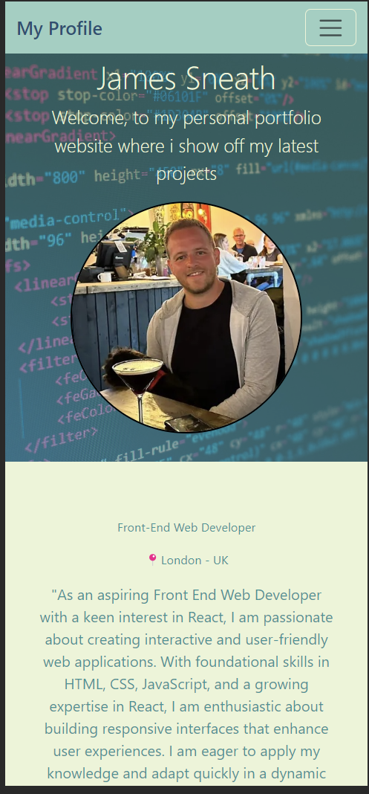

# James-Portfolio-Improved

## Introduction

Welcome to the improved version of my personal web portfolio! Designed as part of a challenge to enhance my original portfolio, this project allowed me to delve deeper into Bootstrap and explore dynamic CSS features, particularly with hover attributes over project cards. While currently featuring one main website, the portfolio also includes GitHub links to other significant projects, demonstrating my evolving journey in web development.

## Emphasis on Mobile-First Design

This portfolio is crafted with a mobile-first approach, ensuring a seamless and engaging experience on mobile devices. The responsive design guarantees that the layout adapts gracefully to different screen sizes, from phones to desktops, making it accessible and user-friendly across a wide range of devices.

## Features

- **Personal Introduction:** The home page greets visitors with my name, a recent photograph, and quick access to various sections like about me, my work, skills, and contact information.
- **Responsive Navigation:** The navigation bar provides smooth scrolling to different sections of the site, offering an intuitive and efficient way to explore the content.
- **Portfolio Showcase:** In the 'Work' section, visitors can view images of my projects. Currently, some images are placeholders, but they will be updated with real applications as I progress in my career. The dynamic CSS hover effects on these cards reveal more information about each project, adding an interactive element to the experience.

## Quick Links

- **GitHub Repository:** [https://github.com/jsneath/Profile-page-react](https://github.com/jsneath/Profile-page-react)
- **Live Portfolio:** [https://react-portfolio-jsneath.netlify.app/](https://react-portfolio-jsneath.netlify.app/)

## Future Enhancements

As I continue to grow and develop more projects, this portfolio will be regularly updated to reflect my latest work and skills. Stay tuned for more exciting features and enhancements!
